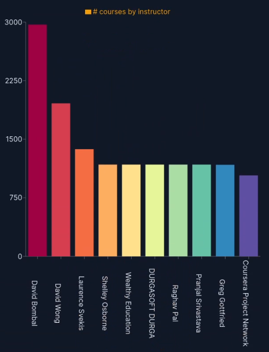
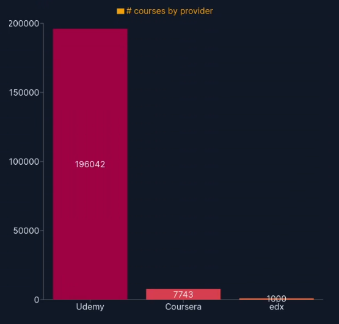
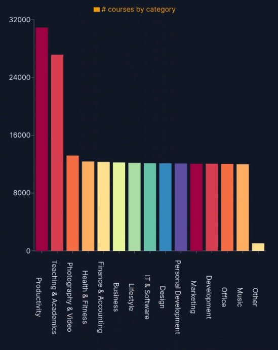
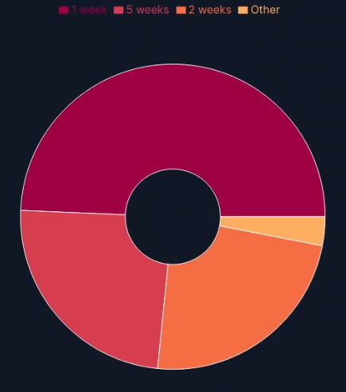
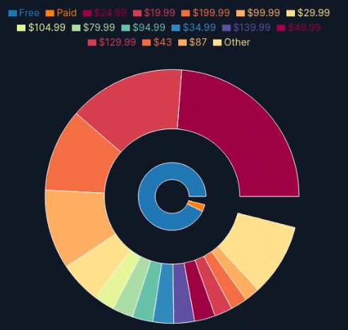
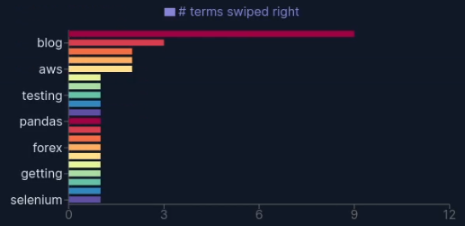

# SMATCH
Your course matching app.


## Description

Have you ever wanted to learn a new skill online?
but you just ended up feeling overwhelmed from the hundreds of different courses to pick from?

Well, we have the solution for you! SMATCH will help you find the course that suits your need based on the budget, time and interest that you have!
Using the cutting-edge machine learning and recommender system technology, we are able to pick suitable courses from over 200 000 courses from all over 
the 3 major MOOCs platforms (EDX, Coursera, Udemy)

## Project Architecture


## Libraries / Algorithms Used

- Data scraping 
        - Beautiful soup and Udemy developer API, Connections are all done in Python (pandas). 

- Back end
                
| Technology | Function |
| ------ | ------ |
| Scikit Learn - Naive based algorithm | For data preperation, we label the data uniformly using Naive based algorithm text classification |
| Scikit Learn - TF- IDF | For the recommender system, we use TF-IDF content based algorithm |
| Scikit Learn - K-Means | we put them into clusters using K-Means so we can recommend a specific clusters to the user |
| Pandas | To manipulate and handle data|
| PostgreSQL and google cloud | Files are hosted in Google cloud PostgreSQL database as it needs to be accessible by multiple people and allow faster access due to the massive file size |
| Flask | Connection with the front end is done through API developed in Flask |

- Front end

| Technology | Function |
| ------ | ------ |
| React | Used to make a single page application |
| Recharts | Used to make colourful visualisation |
| Tailwind CSS | CSS framework to design the user interface |
| D3 | Used to create the colour pallette for the visualisation |

## Video Demonstration

[](https://www.youtube.com/watch?v=0ZzlW4w0EsM)

## Screenshots of the Visualizations

### Instructors



### Providers



### Categories



### Duration



### Price



### Terms



## How to use the project

FOR COURSE LEARNER:

1. To run the project, first you have to log in into the login page of the application
2. You will then be greeted by cards where you can swipe right (if you agree to the premise written on the card) or right (if you disagree)
3. When you swiped at enough card for the algorithm to work, it will give you a list of courses that suits to your needs and preferences
4. You can click on a course, and get a detailed overview (price, duration, provider, short description, and link) of the course
5. To connect with other learners, you can go to the forum tab where you can post a thread, read threads from other people and reply to them
6. When you are done, you can log out on the profile tab

FOR COURSE DEVELOPER:
1. To run the project, first you have to log in into the login page of the application
2. Go to the visualisation tab where you can see the statisitcs of available course such as how many courses are free and paid, how long do most of the courses lasts, what categories have the most courses, etc.
3. When you are done, you can log out on the profile tab

## How to run and deploy the project

You need to have Node.js, Yarn, Python 3, and Pip installed.

First set the URL to the backend in `smatch-frontend/src/hooks.js` under `API_URL`.

### Running the Frontend

```
cd smatch-frontend
yarn
yarn start
```

### Building and Deploying the Frontend

```
cd smatch-frontend
yarn
yarn build
```

Then deploy the files in `build` on a server of choice (eg Static File Server, CDN, ...).

### Running the Backend

```
cd smatch-backend
pip install -r requirements.txt
python main.py
```

## Group Members
- Jean Qussa
- Nurmalita Manggali
- Nave Wibowo
- Ali Amini
